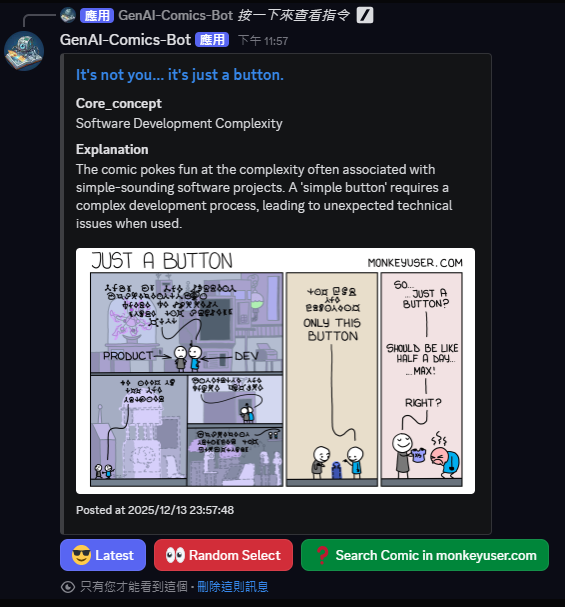
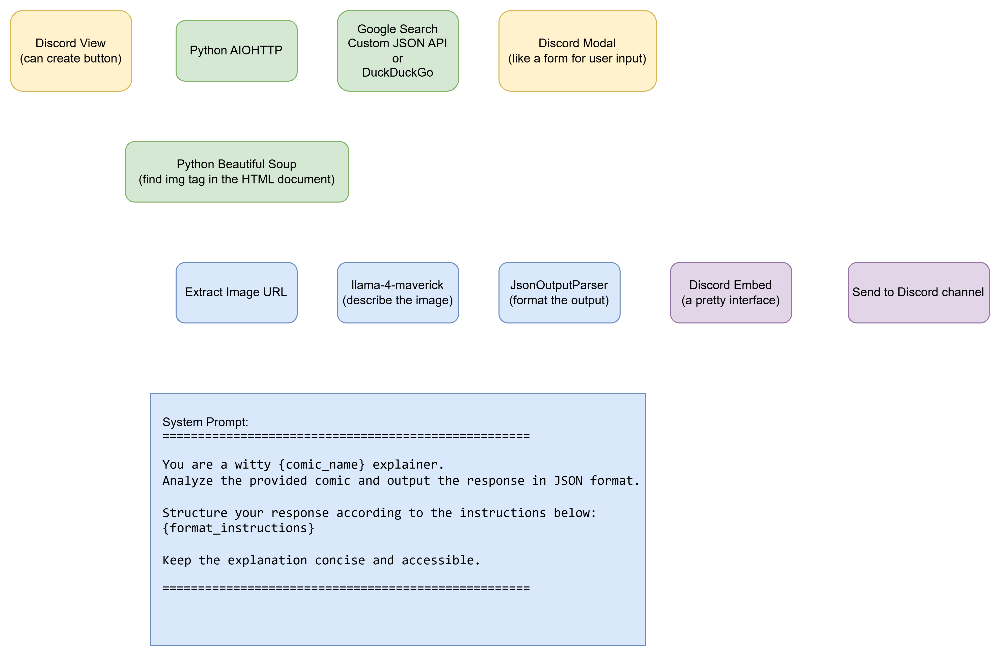

# 🤖 Discord AI Comic Explainer Bot (GenAI-Comics-Bot)


A smart Discord bot that delivers your daily dose of tech humor. It scrapes popular webcomics and uses **Vision LLMs (Llama-4)** via LangChain to understand image content and explain the punchlines.

## User Interface


## Scheme


## Features

- **Daily Webcomic Scraping**: Automatically fetches and parses comics from:
  - **[MonkeyUser](https://www.monkeyuser.com/)** (Software Engineering life) 
  - **[xkcd](https://xkcd.com/)** (Romance, Sarcasm, Math, and Language)
  - **[turnoff.us](https://turnoff.us/)** (Geek culture & Linux) 
- **AI-Powered Explanations**: Uses the [**Groq API** (llama-4 Vision)](https://console.groq.com/docs/vision) to analyze comic images and generate concise explanations for the jokes.
- **Smart Search Integration**:
  - **Google Custom Search JSON API**: High accuracy search restricted to specific comic domains.
  - **DuckDuckGo**: A completely free fallback option for searching comics.
- **Rich User Interface**: Built with Discord Slash Commands, Buttons, and Modals for a seamless user experience.
- **Dynamic Configuration**: Change search engines or AI models on the fly via commands.


## Quick Start

### Prerequisites

- Docker & Docker Compose installed.
- A **Discord Bot Token** ([Guide](https://discord.com/developers/applications)).
- A **Groq API Key** ([Get Key](https://console.groq.com/keys)).
- **Discord IDs**: You will need the **Server ID** (Guild ID) and target **Channel IDs**. 
  - *Tip: Enable "Developer Mode" in Discord Settings > Advanced to right-click and "Copy ID".*
- (Optional: If you want to use Google search engine) **Google Custom Search API Key** & **Search Engine IDs** (See setup guide below).

### Google Search Setup (Optional)
For better search accuracy, it is recommended to set up the Google Custom Search API. If skipped, the bot will default to DuckDuckGo.

1. **Enable the API**:
   Go to the Google Cloud Console and enable the **[Custom Search API](https://console.cloud.google.com/apis/library/customsearch.googleapis.com)**.

2. **Get API Key**:
   Generate a generic Google API Key from the **[Credentials Page](https://console.cloud.google.com/apis/credentials)**.

3. **Configure Search Engines**:
   Visit the **[Programmable Search Engine](https://programmablesearchengine.google.com)** dashboard. You need to create separate search engines for each comic site to ensure accurate filtering.
   
   * **Create 3 separate search engines** and configure them as follows:
       * **XKCD**: Restrict domain to `www.xkcd.com/`
       * **Turnoff.us**: Restrict domain to `turnoff.us/geek/*`
       * **MonkeyUser**: Restrict domain to `www.monkeyuser.com/*`
   * **Enable Image Search**: For each search engine, make sure to toggle **"Image search"** to ON.
   
   *Copy the `Search Engine ID` (cx) for each one and paste them into your `.env.secret` file.*

### Installation
1. **Clone the repository**
   ```bash
   git clone https://github.com/Sean95164/discord-ai-comic-explainer.git
   cd discord-ai-comic-explainer
   ```

2. Set up Environment Variables The project includes a template file named `.env.secret.template.` Copy this file to `.env.secret` and fill in your keys.
    ```bash
    # Copy the template
    cp .env.secret.template .env.secret
    
    # Edit the file with your actual keys
    nano .env.secret
    ```
3. (Optional) Review Public Configs: Check .env.public for general settings
4. Run with Docker Build and start the container in the background:
    ```bash
    docker compose up -d --build    
    ```
   
## Usage
| Command          | Description                                                      |
|------------------|------------------------------------------------------------------|
| `/help`          | Show the list of available commands                              |
| `/settings`      | Check current bot parameters                                     |
| `/xkcd`          | Open the xkcd comic interface                                    |
| `/turnoff_us`    | Open the turnoff.us comic interface                              |
| `/monkey_user`   | Open the monkeyuser comic interface                              |
| `/search_engine` | Switch between `google` and `duckduckgo`                         |
| `/image_llm`     | Switch Vision models (e.g., `llama-4-scout`, `llama-4-maverick`) |

Interactive Features
- Latest: Fetches the newest comic strip.
- Random Select: Randomly retrieves a comic from the archive.
- Search: Click the green button to open a modal, input keywords (e.g., "Python" "Linux"), and the bot will find and explain the comic.

